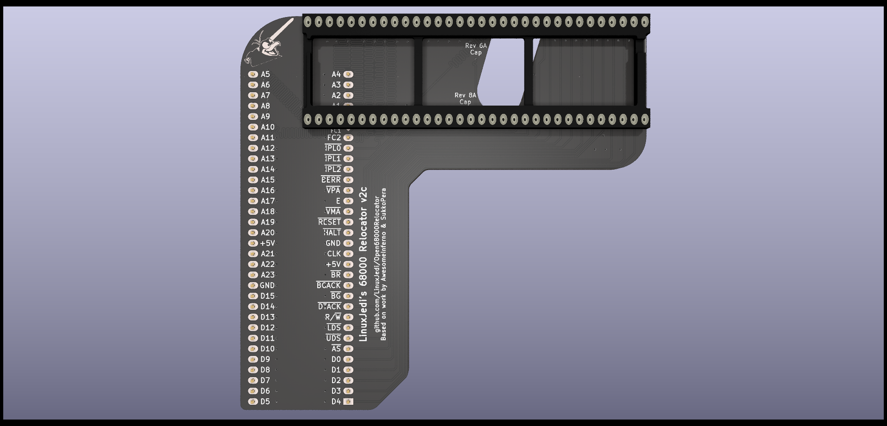

# Open68000Relocator
Open68000Relocator is an Open Hardware adapter PCB that changes the orientation of a 68000 DIP CPU.

## Summary
This is based on [SukkoPera's](https://github.com/SukkoPera/Open68000Relocator) awesome 68000 relocator. I've just added a few things that are useful to me such as a hole for the capacitor in rev 6 and 8 Amiga 500s.

If you like this board please go to SukkoPera's GitHub and sponsor him.

## License
Open68000Relocator is Open Hardware released under the GNU General Public License (GPL) v3. If you make any modifications to the board, **you must** contribute them back.

Open68000Relocator is provided to you ‘as is’ and without any express or implied warranties whatsoever with respect to its functionality, operability or use, including, without limitation, any implied warranties of merchantability, fitness for a particular purpose or infringement. We expressly disclaim any liability whatsoever for any direct, indirect, consequential, incidental or special damages, including, without limitation, lost revenues, lost profits, losses resulting from business interruption or loss of data, regardless of the form of action or legal theory under which the liability may be asserted, even if advised of the possibility or likelihood of such damages.

